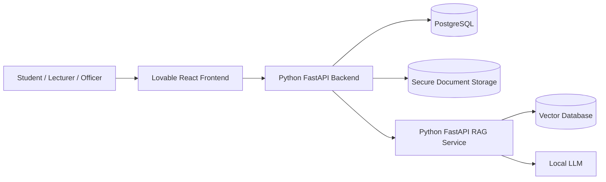

# Architecture

The Agentic AI Enrolment & Credit Mapping System uses three independently deployable applications:

- Frontend: Lovable / React / TypeScript / Vite.
- Backend: Python / FastAPI / Pydantic / SQLAlchemy / PostgreSQL.
- RAG Service: Python / FastAPI / Pydantic / embeddings / vector retrieval / local or Hugging Face-compatible models.

## Deployment Boundaries

The frontend is independently deployable.

The backend is independently deployable.

The RAG service is independently deployable.

Docker Compose may later support local development and integration testing, but it must not force the services to be deployed together.

## Communication Rules

- The frontend communicates with the backend only.
- The frontend must never access PostgreSQL directly.
- The frontend must never access a vector database directly.
- The frontend must never access private document storage directly.
- The frontend should not call the RAG service directly for privileged data operations.
- The backend remains the business and authorization authority.
- The backend may call the RAG service.
- The RAG service must not approve or reject academic credit.
- AI provides recommendations only.
- Authorized academic staff make final credit mapping decisions.
