# Data Model

The backend database owns structured enrolment, academic, document metadata, credit mapping, and audit-ready operational data for the Agentic AI Enrolment & Credit Mapping System.

It does not own RAG embeddings, vector indexes, local LLM state, or semantic retrieval data. Those belong in the separate `agentic-enrolment-rag` repository and its future vector store. The backend may later orchestrate RAG requests through APIs after authorization checks.

## Entity Overview

- `User`: an application identity that can later support SSO/OIDC. No passwords are stored in T003.
- `Role` and `UserRole`: role assignments for future RBAC and authorization policies.
- `Country`: ISO-style country configuration for multi-country support.
- `Institution`: universities, colleges, vocational institutions, and prior education providers.
- `Program`: programs offered by an institution with a credit system and effective dates.
- `Course`: current institution courses, versionable over time through effective dates.
- `Student`: links a user to a student number scoped by current institution.
- `StudentProfile`: profile/contact data for a student without unnecessary duplication.
- `EnrolmentApplication`: student application status and review metadata.
- `PreviousEducation`: prior study at an institution, with snapshot naming for historical integrity.
- `PreviousCourse`: courses completed before the current program.
- `Qualification`: professional certifications, diplomas, and industry qualifications.
- `ExternalProfileLink`: student-provided external profile URLs with consent metadata only; no scraping.
- `StudentDocument`: metadata for uploaded files. File bytes are not stored in PostgreSQL.
- `CreditMappingRequest`: request to map a previous course to a target current course.
- `CreditMappingEvidence`: documents attached as evidence for a credit mapping request.
- `CreditMappingDecision`: final human decision record. There is no `decided_by_ai` field.
- `HistoricalCreditMapping`: imported or stored previous academic decisions for future lookup and RAG ingestion.

## ER Diagram

```mermaid
erDiagram
    USER ||--o| STUDENT : represents
    USER }o--o{ ROLE : has

    COUNTRY ||--o{ INSTITUTION : contains
    INSTITUTION ||--o{ PROGRAM : offers
    INSTITUTION ||--o{ COURSE : owns
    PROGRAM ||--o{ COURSE : includes

    STUDENT ||--|| STUDENT_PROFILE : has
    STUDENT ||--o{ ENROLMENT_APPLICATION : submits
    STUDENT ||--o{ PREVIOUS_EDUCATION : has
    STUDENT ||--o{ STUDENT_DOCUMENT : uploads
    STUDENT ||--o{ QUALIFICATION : owns
    STUDENT ||--o{ EXTERNAL_PROFILE_LINK : provides

    PREVIOUS_EDUCATION ||--o{ PREVIOUS_COURSE : contains

    STUDENT ||--o{ CREDIT_MAPPING_REQUEST : requests
    PREVIOUS_COURSE ||--o{ CREDIT_MAPPING_REQUEST : sources
    COURSE ||--o{ CREDIT_MAPPING_REQUEST : targets
    CREDIT_MAPPING_REQUEST ||--o{ CREDIT_MAPPING_EVIDENCE : uses
    STUDENT_DOCUMENT ||--o{ CREDIT_MAPPING_EVIDENCE : supports
    CREDIT_MAPPING_REQUEST ||--o{ CREDIT_MAPPING_DECISION : produces

    INSTITUTION ||--o{ HISTORICAL_CREDIT_MAPPING : source
    INSTITUTION ||--o{ HISTORICAL_CREDIT_MAPPING : target
    COURSE ||--o{ HISTORICAL_CREDIT_MAPPING : target_course
```



## Multi-Country Design

The database supports students and institutions from different countries through shared tables and configuration. It does not create country-specific tables such as `student_australia`, `student_germany`, or `student_turkey`.

Future country-specific academic rules should be implemented through Strategy Pattern classes under `app/country_strategies/`, not by adding country-specific route logic.

## Constraints and Indexes

Important constraints include:

- Case-normalized application email with a unique lower-case email index.
- Unique student number per current institution.
- Unique institution external code per country.
- Non-negative credit values and file sizes.
- Date range checks where start/effective dates and end dates both exist.
- Human `decided_by_user_id` on credit mapping decisions.

Important indexes include:

- Country code.
- User email lower-case expression index.
- Institution external code and country.
- Student number and current institution.
- Program code.
- Course code.
- Enrolment status.
- Credit mapping request status.
- Historical source course code.

## Development Seed Data

The development seed mechanism creates reference countries, roles, a clearly fake demo student with student number `11111`, and mock historical mappings. It does not create real students or real personal data.

Run a dry-run preview without PostgreSQL:

```powershell
python -m app.infrastructure.database.seed --dry-run
```

Run against configured PostgreSQL after migrations are applied:

```powershell
python -m app.infrastructure.database.seed
```
